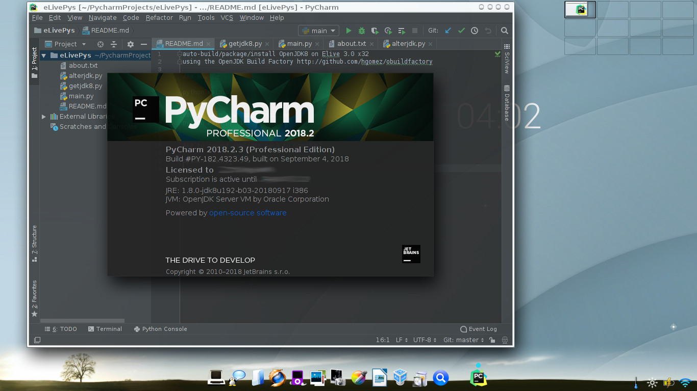

auto-build/package/install OpenJDK8 on Elive 3.0 x32
using the OpenJDK Build Factory http://github.com/hgomez/obuildfactory

### How-To

python main.py

### to skip download/compiling
python main.py -i 1

### to revert symlinks back to OpenJDK7

python main.py -i 1 -r 0

