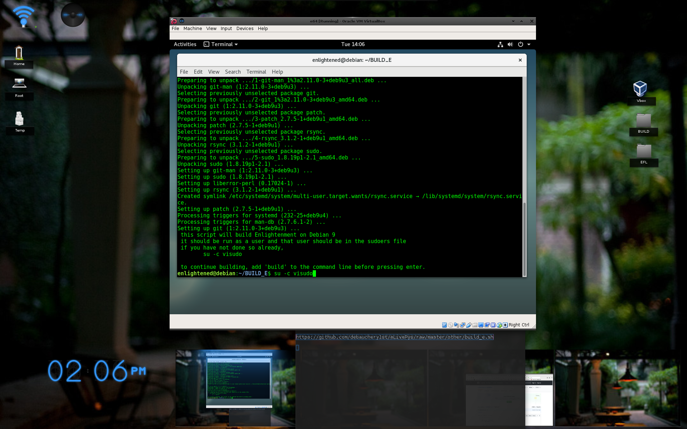
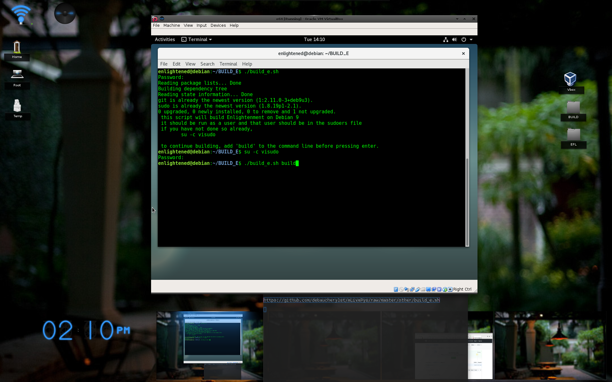

#### Build enlightenment on Debian 9 (x64)

I used the non-free ISO-DVD 
- (it contains extra firmware)

https://cdimage.debian.org/cdimage/unofficial/non-free/cd-including-firmware/9.5.0+nonfree/amd64/iso-dvd/

##
Setup the virtual machine (or plugin your computer)

##
8+ Gb of RAM

##
23.04+ GB of storage

##
Install Debian.

##
After rebooting, open a terminal and download the build script.
    
    wget https://github.com/debauchery1st/eLivePys/raw/master/other/build_e.sh

##
Get your motor runnin'

    chmod +x ./build_e.sh
    ./build_e.sh

##
Head out on the highway

    su -c visudo

##
Lookin' for adventure

    
    ./build_e.sh build

##
And whatever comes our way

##
Yeah Darlin' go make it happen

Take the world in a love embrace

Fire all of your guns at once

And explode into space...

You will need to supply 

The password a few times

When it finishes building, reboot and select "Enlightenment"

##
You will be greeted by the e wizard

##
Welcome to the latest version of e.

##
